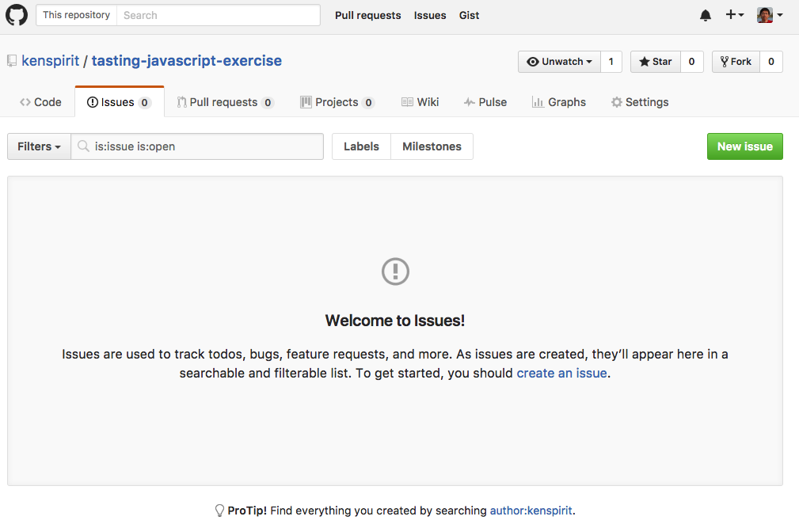
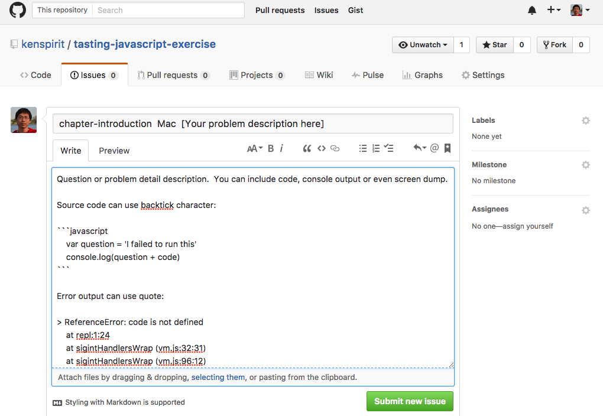

## Introduction

[Tasting JavaScript]:https://leanpub.com/tasting-javascript

This repository is a companion for my book [Tasting JavaScript][].  It serves below purposes:  

1. Stores the answer for the exercises in the book.  
2. Collects questions of the books and exercises from the reader.  
3. Provides a platform for reader to discuss and me to answer the questions.  

Github issues can be used to achieve them.  

## How to submit your questions through Github issue.

### Click on `Issues` tab

### Create new issue

By clicking on the `New issue` button, you can see a screen like below.  Sample data is filled as a template for you to better describe the question and for other to understand it and help you.  

A standard format is proposed for the issue subject.  It consists three part, the very first one is `chapter-xxxxxx` or `exercise-yyyyyy` which stands for the question is about which book chapter or exercise.  Two space characters after that is your environment, say Window 7 or Mac.  Then two more spaces after is the brief problem or question.  

The detail of the question and problem can be provided in the content as the sample attached.  Better formatting on source code or console output can ease other people to identify your issue and provide feedback.  

How to concisely ask question and provide necessary information requires you to learn about it.  But don't be afraid to start the first step, politely and bravely ask.  
